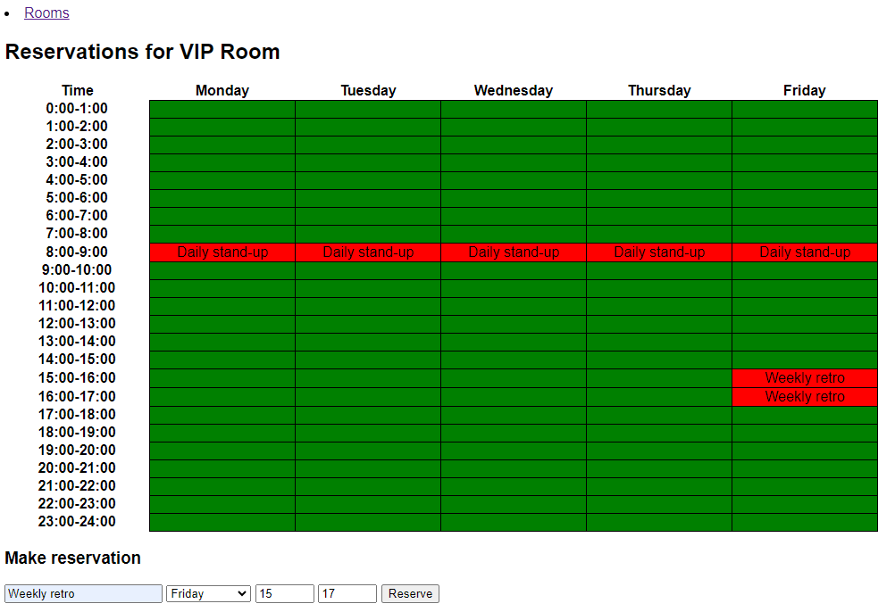

## Programozás 2 ZH feladat

A feladat egy meeting room foglaló webapplikáció prototípusának elkészítése.

A prototípusnak csak a következő hét foglalásait kell tudnia kezelni, és az éles rendszerhez képest csökkentett funkcionalitással bír.
(Iteratív szoftverfejelsztés FTW.)

A történt módosítások kerüljenek mentésre adatbázisba vagy fájlba, és a következő indításnál töltse be őket az alkalmazás.

### Elvárt funkciók

- Termek kezelése
  - Listázás
    - A termek aloldalaira mutató linkekkel
  - Hozzáadás
    - Terem nevének megadása (egyedi kell legyen)
  - Termek egész hetes kihasználtságának összehasonlítása oszlopdiagramon
- Terem aloldalán foglalások kezelése
  - Terem foglaltságának megjelenítése
    - Táblázat 5 oszloppal (hétfő-péntek), soronként 1 óra
      - Zöld: elérhető
      - Piros: foglalt
        - Esemény megnevezése jelenjen meg
  - Terem foglalása
    - Időtartam megadása
      - Nap (hétfő, kedd, ...)
      - Kezdési idő (egész óra: 0, 1, ..., 23)
      - Befejezési idő (egész óra: 1, 2, ..., 24)
        - Ha kezdés >= befejezés, akkor hibaüzenet
    - Esemény nevének megadása (nem kell, hogy egyedi legyen)
    - Ellenőrzés
      - Ha a terem az időtartam bármely részében már foglalt, hibaüzenet
      - Különben a teremfoglalás mentése
  - Összes foglalás törlése (új hét indítása)

A megadott template-eket ki kell egészíteni, vagy készíthető saját template is.

A megadott `room.html` egy 5x24 elemű `reservations` mátrixban várja, hogy az egyes napok egyes óráiban milyen esemény van az adott teremben.
Ha semmi, akkor az elem egy üres string.
De a template tetszőlegesen módosítható.

